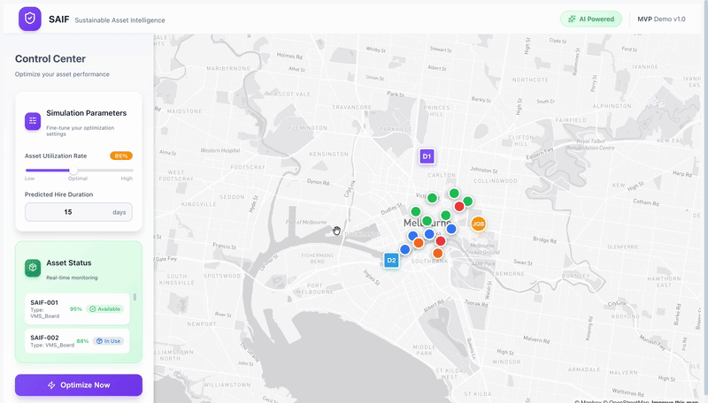
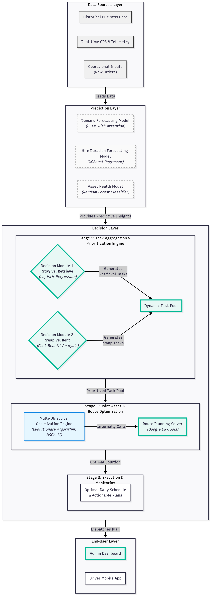

# 🚚 SAIF Dashboard - Sustainable Asset Intelligence Framework

<div align="center">

**A sophisticated multi-layer AI system that optimizes asset deployment through predictive modeling, evolutionary algorithms, and real-time decision engines**

*Demonstrating advanced ML/AI techniques: LSTM + XGBoost + NSGA-II + OR-Tools integration*

</div>

## 🎬 Live Demo



*Showcasing: Real-time AI optimization → Multi-stage decision process → Animated route planning → Cost/emission impact*

---

## ✨ Core AI Architecture

🧠 **Multi-Layer Prediction Engine** - LSTM + XGBoost + Random Forest models for demand forecasting, hire duration prediction, and asset health assessment

⚡ **3-Stage Decision Framework** - Task aggregation → Multi-objective optimization (NSGA-II) → Route planning (OR-Tools)

🎯 **Intelligent Decision Modules** - Logistic regression for stay/retrieve decisions + cost-benefit analysis for swap/rent optimization

📊 **Real-time Data Integration** - Combines historical business data, GPS telemetry, and operational inputs for comprehensive optimization

🔄 **Multi-Objective Optimization** - Evolutionary algorithms balance cost reduction, emission savings, and operational efficiency

### System Architecture
<div align="center">

</div>

---

## 🛠️ Tech Stack

**AI & Optimization Core**
- Multi-objective optimization (NSGA-II evolutionary algorithm)
- Route planning (Google OR-Tools TSP solver)
- Machine Learning (LSTM, XGBoost, Random Forest)

**Frontend & Visualization**
- React + TypeScript + Mapbox GL JS
- Real-time data visualization + Interactive decision dashboard

---

## 🚀 Getting Started

1. **Clone and install**
   ```bash
   git clone https://github.com/li-shch/saif-dashboard.git
   cd saif-dashboard
   npm install
   ```

2. **Add Mapbox token**
   Create `.env.local` and add your token:
   ```env
   VITE_MAPBOX_TOKEN=your_mapbox_token_here
   ```
   Get free token: https://account.mapbox.com/access-tokens/

3. **Run the project**
   ```bash
   npm run dev
   ```
   Open http://localhost:5173

---

## 🎮 AI Decision Process

1. **Data Ingestion** - Real-time GPS, historical patterns, and operational constraints
2. **Predictive Analysis** - LSTM forecasts demand, XGBoost predicts hire duration, Random Forest assesses asset health
3. **Multi-Stage Optimization** - Task prioritization → NSGA-II optimization → OR-Tools route planning
4. **Decision Output** - Stay/retrieve/swap/inspect decisions with cost-benefit analysis

### AI Decision Types
- **Stay on Site** vs **Retrieve to Depot** (Logistic Regression)
- **Asset Swap** vs **Competitor Rental** (Cost-Benefit Analysis)  
- **Maintenance Scheduling** (Health Score Thresholds)
- **Route Optimization** (TSP with Real Road Networks)

---

<div align="center">

**Built for hackathons - Demonstrating the future of sustainable asset management**

⭐ Star this repo if you found it helpful!

</div>